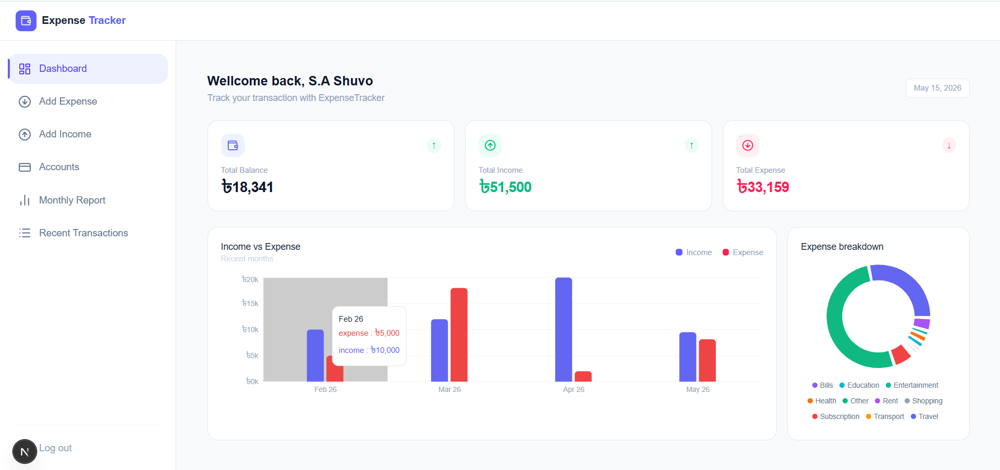
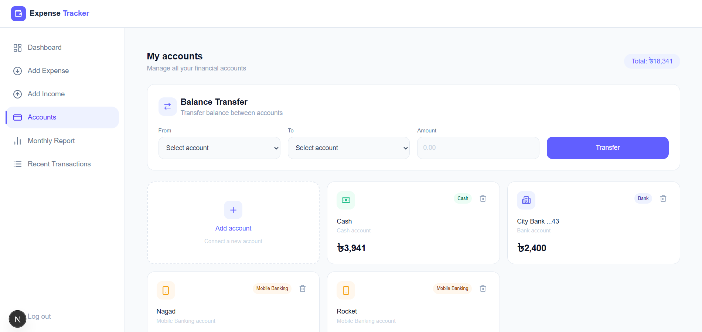
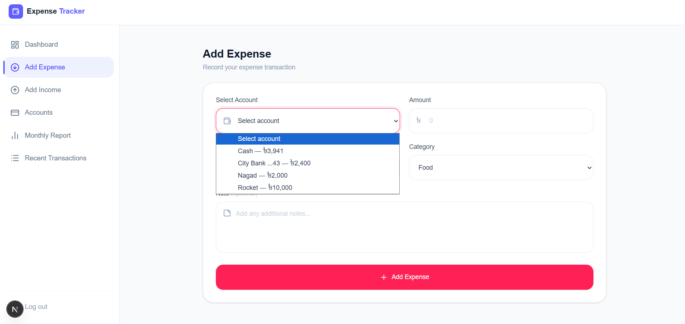
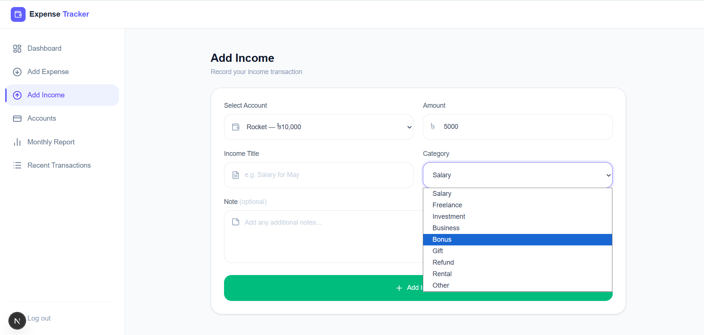
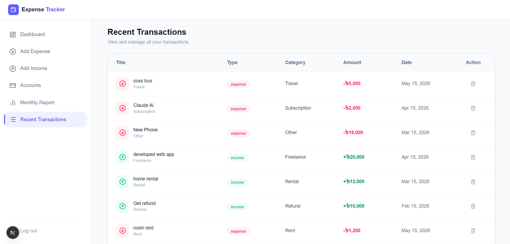
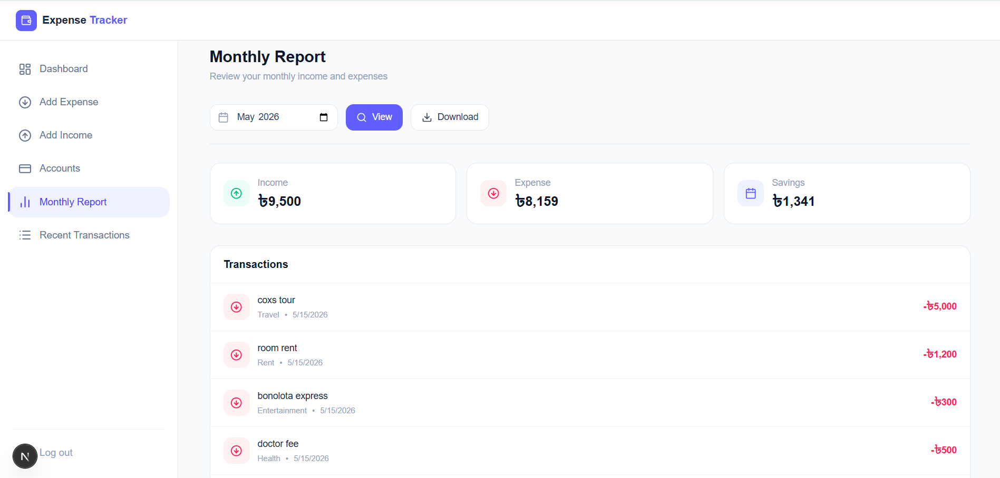

# Personal Expense Tracker

A full-stack personal expense tracking application where users can manage income, expenses, multiple accounts, balance transfers, reports, and analytics.

Users can:
- Track income and expenses
- Manage multiple accounts
- Transfer balance between accounts
- View monthly reports
- Download reports
- Analyze income vs expense charts

live link: https://expense-tracker-frontend-ruby-nine.vercel.app

# Features

## Authentication
- JWT Authentication
- Login & Registration
- Protected Routes

## Account Management
- Create multiple accounts
- Delete accounts
- Different account types:
  - Cash
  - Bank
  - Card
  - Mobile Banking

## Income & Expense
- Add income
- Add expense
- Category-based expense tracking

## Reports
- Monthly report generation
- Download report as PDF

## Transactions
- Transaction history
- Delete transactions

## Analytics
- Income vs Expense charts
- Financial overview dashboard

## Balance Transfer
- Transfer balance between accounts

# Tech Stack

## Frontend
- Next.js
- React.js
- Tailwind CSS
- Lucide React
- React Hot Toast

## Backend
- Express.js
- MongoDB
- JWT Authentication

# Folder Structure

## Frontend

```text
frontend/
│
├── app/
│   │
│   ├── (auth)/
│   │   ├── login/
│   │   └── register/
│   │
│   ├── (dashboard)/
│   │   ├── dashboard/
│   │   ├── add-expense/
│   │   ├── add-income/
│   │   ├── accounts/
│   │   ├── monthly-report/
│   │   └── transactions/
│   │
│   ├── components/
│   │   ├── navbar.jsx
│   │   └── sidebar.jsx
│   │
│   └── not-found.jsx
│
└── package.json
```


## Backend

```text
backend/
│
├── controllers/
│   ├── user.controller.js
│   ├── account.controller.js
│   ├── auth.controller.js
│   └── transaction.controller.js
│
├── middleware/
│   └── authMiddleware.js
│
├── models/
│   ├── User.js
│   ├── Account.js
│   └── Transaction.js
│
├── routes/
│   ├── account.route.js
│   ├── transaction.route.js
│   └── user.route.js
│
├── config/
│   └── db.js
│
├── app.js
├── package.json
└── .env
```

# Database Schema

## User Model

| Field | Type |
|------|------|
| name | String |
| email | String |
| password | String |


## Account Model

| Field | Type |
|------|------|
| userId | ObjectId |
| name | String |
| type | String |
| balance | Number |


## Transaction Model

| Field | Type |
|------|------|
| userId | ObjectId |
| accountId | ObjectId |
| title | String |
| type | String |
| amount | Number |
| category | String |
| note | String |
| transactionDate | Date |

# API Endpoints

## User Routes

| Method | Endpoint | Description |
|--------|----------|-------------|
| POST | /api/user/register | Register a new user |
| POST | /api/user/login | Login user |
| GET | /api/user/dashboard | Get dashboard summary |
| GET | /api/user/report | Get monthly report |
| GET | /api/user/downloadReport | Download monthly report PDF |
| GET | /api/user/chartData | Get income vs expense chart data |
| GET | /api/user/expenseCategories | Get expense category analytics |


## Transaction Routes

| Method | Endpoint | Description |
|--------|----------|-------------|
| POST | /api/transaction/addExpense | Add expense transaction |
| POST | /api/transaction/addIncome | Add income transaction |
| GET | /api/transaction/show | Get all transactions |
| POST | /api/transaction/delete/:id | Delete a transaction |


## Account Routes

| Method | Endpoint | Description |
|--------|----------|-------------|
| POST | /api/account/add | Add new account |
| GET | /api/account/show | Get all accounts |
| POST | /api/account/transfer | Transfer balance between accounts |
| DELETE | /api/account/delete/:id | Delete an account |

# Authentication Flow

- User registers/login
- Backend generates JWT token
- Token stored in localStorage
- Protected routes check token
- Unauthorized users redirected to login page
# Installation & Setup

### Prerequisites
- Node.js v18+
- MongoDB (local or Atlas)
- npm or yarn

### 1. Clone Repository
```bash
git clone <your-repo-link>
cd your-project-name
```

### 2. Backend Setup
```bash
cd backend
npm install
```

Create a `.env` file in `/backend`:
```env
PORT=5000
MONGO_URI=your_mongodb_connection_string
JWT_SECRET=your_jwt_secret
JWT_ACCESS_EXPIRATION=your_jwt_expiration_time_minute
```

```bash
npm run dev
```

### 3. Frontend Setup
```bash
cd frontend
npm install
```

Create a `.env.local` file in `/frontend`:
```env
NEXT_PUBLIC_API_URL=http://localhost:5000
```

```bash
npm run dev
```

### 4. Access the App
- Frontend: http://localhost:3000
- Backend API: http://localhost:5000


---
# Screenshots

## Dashboard


## Accounts


## Add Expense


## Add Income


## Transactions


## Monthly Report



